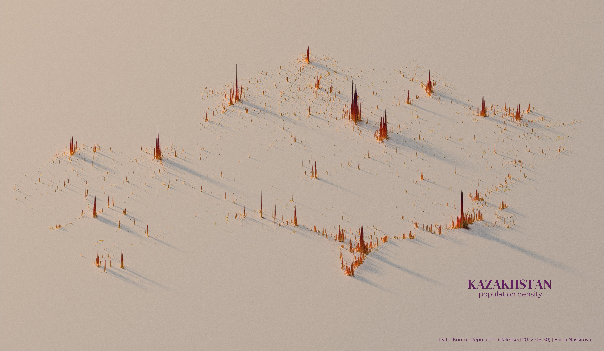
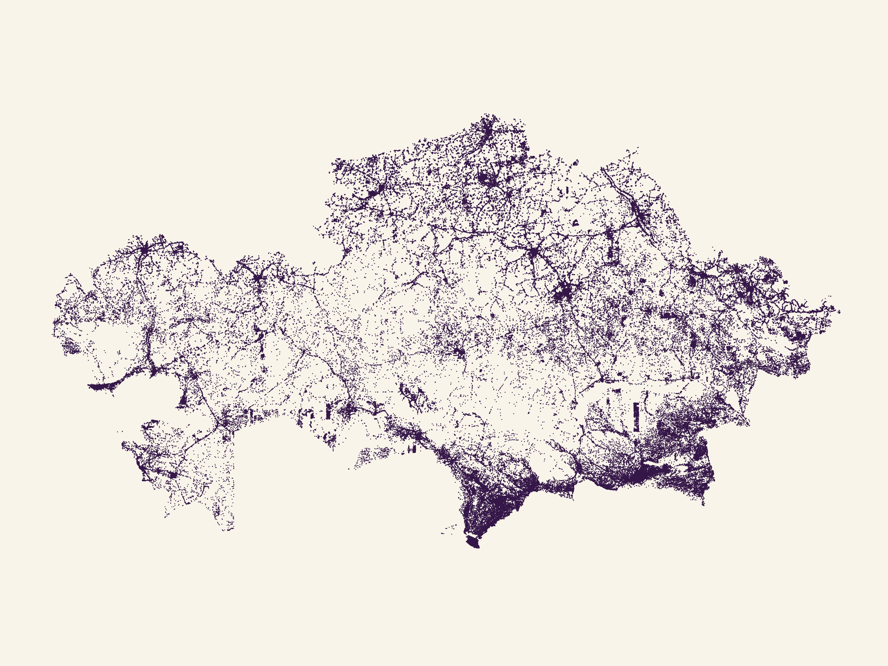

# Kazakhstan density population map using Rayshader library
This is my code in #rstats for creating Kazakhstan population density 3d map using #rayshader library.

## Credits
* Huge thanks to @Pecners for his detailed and helpful [YouTube](https://www.youtube.com/watch?v=zgFXVhmKNbU) tutorial
* [rayshader library documentation](https://www.rayshader.com/)

## Maps in 3D and 2D

